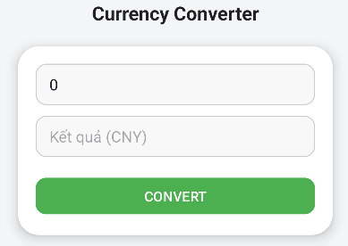
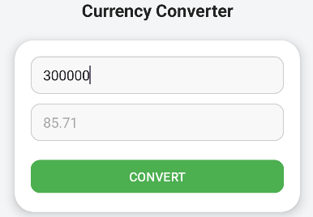
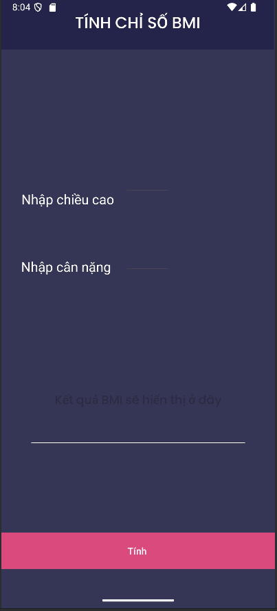
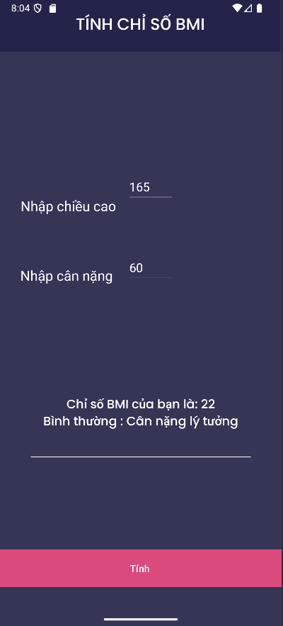
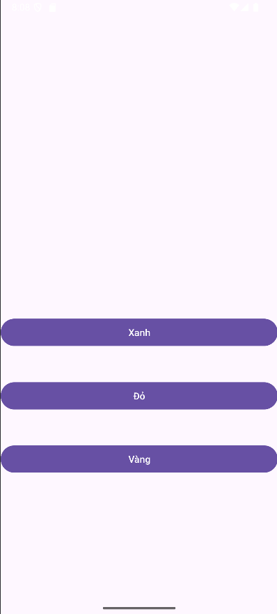
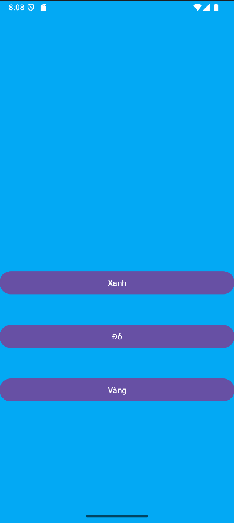
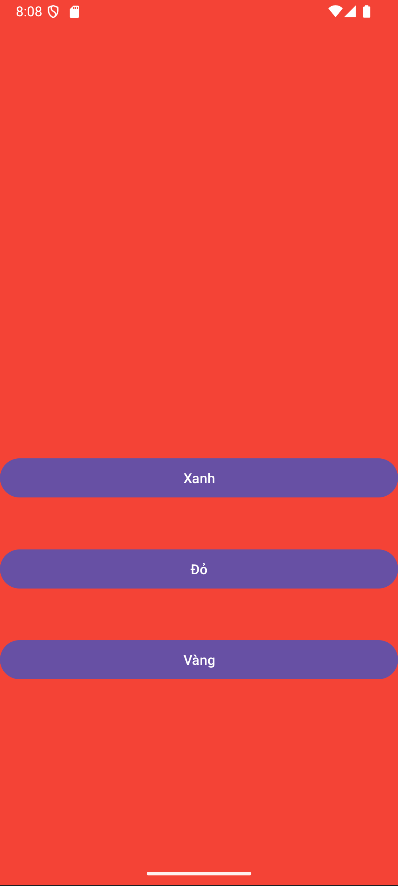
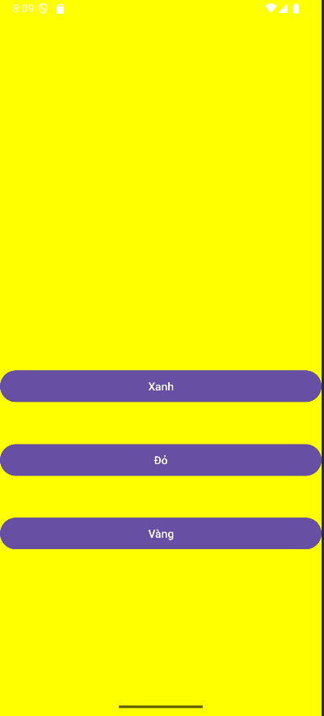
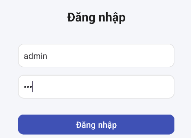

# 👋 Welcome to my repositories

*Ở đây có tất cả những dự án lập trình di động cơ bản mà tôi đã thực hiện.*  
Mỗi dự án đều có phần giao diện minh họa và mô tả ngắn gọn bên dưới.

---

## 💱 [Currency Converter](./UnitConverter)
Ứng dụng quy đổi tiền tệ từ **VNĐ** sang **CNY**.  
Giao diện đơn giản, trực quan, dễ thao tác.

| Giao diện ban đầu | Sau khi quy đổi |
|--------------------|-----------------|
|  |  |

---

## ⚖️ [BMI Calculator](./BMI)
Ứng dụng tính **chỉ số khối cơ thể (BMI)** dựa trên cân nặng và chiều cao.  
Giúp người dùng biết được tình trạng cơ thể hiện tại.

| Giao diện nhập dữ liệu | Kết quả tính BMI |
|------------------------|------------------|
|  |  |

---

## 🎨 [Change Theme App](./IamthemChangeTheme)
Ứng dụng đổi **chủ đề nhiều màu** cho giao diện Android.  
Lưu lại chế độ người dùng đã chọn bằng SharedPreferences.

| Giao diện đầu tiên | Giao diện xanh | Giao diện màu đỏ | Giao diện màu vàng |
|--------------------|----------------|------------------|--------------------|
|  |  |  |  |

---

## 🔑 [Login Example](./LamthemDangnhap)
Ứng dụng mô phỏng đăng nhập cơ bản với giao diện thân thiện.  
Bao gồm kiểm tra tài khoản và hiển thị thông tin sau khi đăng nhập.

| Màn hình đầu tiên |  Màn hình đăng nhập | Sau khi đăng nhập sẽ chuyển sang màn hình mới |
|-------------------|----------------------|-------------------|
|  |  |  |

---

## 🧱 [Layout Demo](./Layout1)
Dự án minh họa các loại **layout cơ bản trong Android** như LinearLayout, RelativeLayout, ConstraintLayout.  
Phù hợp cho người mới học thiết kế giao diện.

| Ví dụ Layout | Ứng dụng thực tế |
|---------------|------------------|
|  |  |

---

> ✨ *Tôi sẽ tiếp tục cập nhật thêm các dự án mới trong thời gian tới.*

---

👨‍💻 **Tác giả:** *Lưu Nguyễn Hoàng*  
📅 **Cập nhật gần nhất:** *Tháng 10 / 2025*

