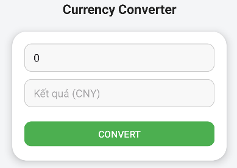

# 💱 Currency Converter

Ứng dụng Android giúp quy đổi tiền tệ từ **VNĐ (Việt Nam đồng)** sang **CNY (Nhân dân tệ Trung Quốc)**.  
Giao diện đơn giản, trực quan – phù hợp cho người mới học lập trình Android.

---

## 🖼️ Giao diện minh họa

| Giao diện ban đầu | Sau khi quy đổi |
|--------------------|-----------------|
|  |  |

---

## ⚙️ Chức năng chính
- Nhập số tiền cần quy đổi (VNĐ)  
- Nhấn nút **Convert** để hiển thị kết quả bằng CNY  
- Tỷ giá cố định (≈ 1 CNY = 3,500 VND)

---

## 🛠️ Công nghệ sử dụng
- **Android Studio**
- **XML (ConstraintLayout)**
- **Java hoặc Kotlin**

---

📅 *Cập nhật: Tháng 10/2025*  
👨‍💻 *Tác giả: Lưu Nguyễn Hoàng*
