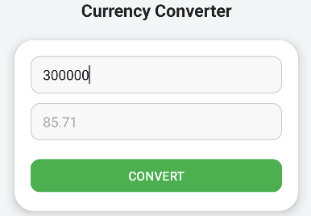

# 💱 Currency Converter

Ứng dụng Android giúp quy đổi tiền tệ từ **VNĐ (Việt Nam đồng)** sang **CNY (Nhân dân tệ Trung Quốc)**.  
Giao diện đơn giản, bắt mắt cơ bản.

---

## 🖼️ Giao diện minh họa

| Giao diện ban đầu | Sau khi quy đổi |
|--------------------|-----------------|
|  |  |

---

## ⚙️ Chức năng chính
- Nhập số tiền cần quy đổi (VNĐ)  
- Nhấn nút **Convert** để hiển thị kết quả bằng CNY  
- Tỷ giá cố định (≈ 1 CNY = 3,500 VND)

---

## 🚀 Cách chạy ứng dụng
1. Clone dự án:
   ```bash
   git clone https://github.com/Luuhocgioi/ThucHanhAndroid/tree/5d186dc60631a2718f4ad675d576e78356490fff/UnitConverter


