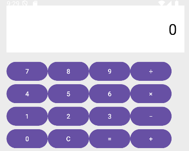
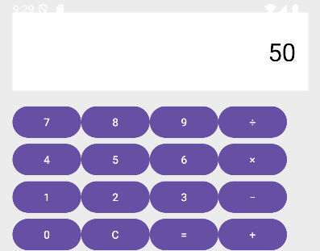

# 🧮 Calculator App

Ứng dụng Android mô phỏng **máy tính cơ bản**, giúp người dùng thực hiện các phép toán **cộng, trừ, nhân, chia**.  
Giao diện được thiết kế tối giản, dễ nhìn và thân thiện với người dùng.

---

## 🖼️ Giao diện minh họa

| Giao diện ban đầu | Sau khi bấm nút 5 và nút 2 | Sau khi bấm nút x và nút 2 | Sau khi bấm nút =|
|--------------------|---------------------------|----------------------------|------------------|
|  |  | ![Nextt][.Image/Calculator3.png]| ![Result][.Image/Calculator4.png] |

---

## ⚙️ Chức năng chính
- Nhập các số từ **0–9**  
- Thực hiện các phép toán: **+**, **−**, **×**, **÷**  
- Nhấn nút **"="** để hiển thị kết quả  
- Nhấn nút **"C"** để xóa toàn bộ phép tính  

---

## 🧩 Cấu trúc giao diện
### **activity_main.xml**
- `TextView` hiển thị kết quả (`@id/tvDisplay`)  
- `GridLayout` chứa các nút:
  - **Số:** `0–9`
  - **Phép toán:** `+`, `−`, `×`, `÷`
  - **Chức năng:** `C`, `=`

---

## 🚀 Cách chạy ứng dụng
1. Clone dự án:
   ```bash
   git clone https://github.com/Luuhocgioi/ThucHanhAndroid/tree/main/Calculator
